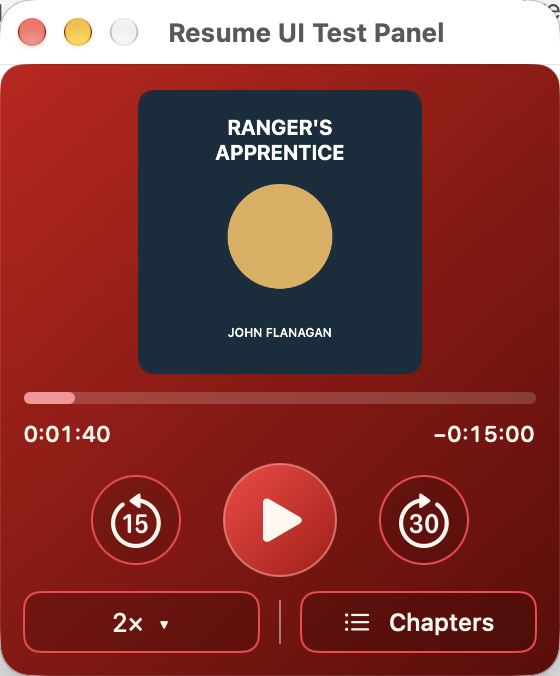

# Resume

A small, keyboard-first macOS menu-bar client for [Audiobookshelf](https://www.audiobookshelf.org/).

Resume keeps one audiobook close at hand. Open the menu bar, start typing to find a book, press Enter to select it, and Space to listen. Playback and progress stay connected to your Audiobookshelf server without turning your Mac into another library-management screen.

<p align="center">
  
</p>

*Current player in the test host with synthetic artwork. The title bar belongs to the test host; normal use is from the menu bar.*

## What it does

- Streams audiobooks from one Audiobookshelf server and selected library.
- Searches locally as you type, showing one best-matching book.
- Provides play/pause, 15-second back and 30-second forward skips, chapters, and per-book playback speed.
- Synchronizes listening progress automatically and offers recovery choices when positions conflict.
- Integrates with macOS media controls and stores credentials in Keychain.
- Keeps Settings, setup and Search inside the same compact panel.

Resume is intentionally a listening utility. It is not a library browser or manager, an offline downloader, a multi-server client, or an Audiobookshelf server. Opening the panel or selecting a book does not autoplay. The progress bar is read-only; use skips or chapters to change position.

## Status

Actively developed by one developer, with coding-agent assistance. The current app is built and tested from source; there are no packaged or notarized releases yet. Native playback and application behavior have automated coverage, while some real-server, hardware and accessibility acceptance remains open. See [testing and its limits](docs/testing.md) and the [issue tracker](https://github.com/Grape9113/Resume/issues).

## Build and run

You need **Xcode 27** and an Audiobookshelf account on an **HTTPS** server. Development and native acceptance currently use **macOS 27**. The project's deployment target is macOS 15, but older systems are not an established support promise. Integration has focused on Audiobookshelf hosted on PikaPods; broader server/media compatibility is still being verified.

```sh
git clone https://github.com/Grape9113/Resume.git
cd Resume
open Resume.xcodeproj
```

Select the **Resume** scheme and choose **Product → Run**. Xcode resolves the pinned Swift packages automatically. Local builds use ad-hoc signing; no distribution certificate is required. The shared scheme stops an existing Resume process before building, so stop active listening first.

Open the book icon in the menu bar, enter your server address and credentials, then choose an audiobook library if prompted. Bare hostnames are normalized to HTTPS. Resume remembers the connection in Keychain. Changing servers or libraries uses **Sign Out** in Settings.

To build without opening Xcode:

```sh
xcodebuild build -project Resume.xcodeproj -scheme Resume \
  -configuration Release -destination 'platform=macOS,arch=arm64'
```

## Keyboard-first use

With the panel active:

| Key | Action |
| --- | --- |
| Type, or ⌘V | Start Search from Player |
| Enter | Select the Search candidate without starting playback |
| Escape | Cancel Search or leave Chapters/Settings |
| Space | Play/pause in Player; type a space in Search |
| ⌘, | Open Settings in the same panel |
| ⌘Q | Quit Resume |

Settings contains Connection details, Launch at Login, available position-recovery choices, and build information. Playback speed is remembered per book and starts at 2× for a new book.

## Development

Run the full suite on the development Mac:

```sh
xcodebuild test -project Resume.xcodeproj -scheme Resume \
  -destination 'platform=macOS,arch=arm64'
```

UI tests use an isolated native window and synthetic services. They need desktop focus, but no Audiobookshelf credentials. Run Xcode tests serially. GitHub Actions runs the core/application/native-adapter tests and a Release build; local UI and real-device acceptance remain separate.

For a bug report, include your macOS/Xcode and Audiobookshelf versions, reproduction steps, and expected versus actual behavior. Remove credentials, tokens and private server details from logs. Keep proposed changes focused; discuss changes to product behavior in an issue before implementing them.

- [Architecture](docs/architecture.md) and [domain glossary](CONTEXT.md)
- [Current specification](docs/specification.md) and [known discrepancies](docs/baseline.md#remaining-discrepancies)
- [Development workflow](docs/workflow.md) and [verification guidance](docs/testing.md)

## License

Resume is licensed under the [BSD Zero Clause License (0BSD)](LICENSE).
Third-party dependencies and vendored workflow skills retain their own licenses; see [third-party notices](THIRD_PARTY_NOTICES.md).
