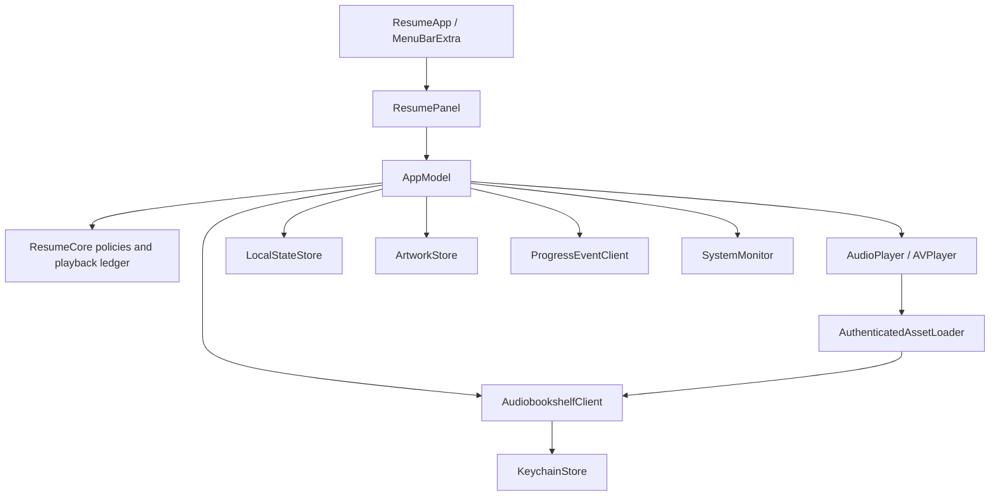

# Resume architecture

This describes the existing working product at the [September 2026 baseline](baseline.md), including the application changes pending on top of `fcab5aa`. Product intent lives in the [current specification](specification.md); known exceptions live in the [reconciliation register](baseline.md#remaining-discrepancies). Names are defined in [CONTEXT.md](../CONTEXT.md).

## Production path and test seams

[ResumeApp](../Sources/Resume/ResumeApp.swift) composes one `@MainActor @Observable` [AppModel](../Sources/Resume/AppModel.swift). [ResumePanel](../Sources/Resume/ResumePanel.swift) presents Connection, library selection, Player, Search, Settings and Chapters in the same surface. Position recovery is inside the synchronization menu. The Debug-only UI host presents the same panel in an ordinary window with fake dependencies; it is not production architecture.

The application model is the highest behavioral seam. It accepts the Audiobookshelf, playback, connection-storage and local-state interfaces, preferences, artwork store and clock. Concrete system monitoring, socket delivery, login-item registration and system media publication are not all replaceable model dependencies. The old spec's idealized list of injectable interfaces must not be mistaken for implemented test coverage.

[ResumeCore](../Sources/ResumeCore) supplies domain values, search and policy logic. Its `ResumeApplication` is an earlier simplified transition model, **not** the shipped state owner. Similarly, `Authenticator` and `SynchronizationPolicy.reconcile` are reference/helper paths rather than the production authentication and reconciliation paths. Tests of those helpers do not establish application conformance. Keep this distinction when choosing a regression seam; removal or refactoring is outside this baseline.

## State and lifetime

| State | Owner and lifetime | Consequence |
| --- | --- | --- |
| Panel mode, current playing intent, observed playing state | Application model; current process | Restoring a book or position never restores autoplay intent. Intent can exist while audio is still loading. |
| Playback-session identity and prepared audio | Application model/player; current process | Sessions are established through the server on explicit preparation. No active session ID is saved in the ledger. |
| Books, active item/selection time, per-book position/speed, synchronization baseline/pending state, temporary recovery, completion epoch | [LocalStateStore](../Sources/Resume/LocalStateStore.swift), atomic Application Support JSON snapshot; [PlaybackLedger](../Sources/ResumeCore/PlaybackLedger.swift) | This is durable listening state, not a disposable cover cache. Failed synchronization must remain recoverable. |
| Server, username, saved password, rotating token pair | [KeychainStore](../Sources/Resume/KeychainStore.swift) | Secrets stay out of preferences, diagnostics and metadata JSON. The token pair is one stored value; connection and tokens are separate writes. |
| Selected library ID/name | Preferences | One Connection has one Selected library; switching uses sign-out/reconnection. |
| Cover bytes | [ArtworkStore](../Sources/Resume/ArtworkStore.swift), Caches | Expendable, fetched with authorization, decoded off the main actor and bounded for display. TTL/revision limitations are recorded separately. |

Before playback, recovery alternatives without an expiry are process-scoped. Post-play alternatives can survive a restart until their saved expiry. Recovery is never a permanent history store. The five-day completion epoch is local observation state; do not describe the backend's latest `lastUpdate` as a guaranteed historical completion timestamp.

## Audiobookshelf and authentication

[AudiobookshelfClient](../Sources/Resume/AudiobookshelfClient.swift) is the concrete actor behind `AudiobookshelfServing`; there is no generic media-provider layer. API and media requests use bearer headers. Media URL validation currently compares scheme and host, not the full origin including port.

Recovery on access rejection shares a single in-flight task, reuses tokens already rotated by another request, and stores the replacement pair together. Definitive refresh rejection permits one saved-password login; transport failures do not justify session churn. The difference between this client error contract and all UI entry points is an open discrepancy, not permission to retain a stuck generic-error experience.

[ProgressEventClient](../Sources/Resume/ProgressEventClient.swift) uses Socket.IO for authorized progress and item notifications. Item changes schedule a debounced library refresh; search itself uses local metadata. Current enumeration is an unpaged `limit=0` request plus progress retrieval. The cached search fields are title, authors and series; the earlier paging/subtitle/alias ambitions are not verified implementation guarantees.

## Playback and asynchronous ownership

[AudioPlayer](../Sources/Resume/AudioPlayer.swift) uses AVPlayer and the default Now Playing information center/shared remote command center. Single-file audio uses an asset item; multipart audio composes tracks after loading every part's metadata. Large multipart startup cost is not established by the three-part fixture.

[AuthenticatedAssetLoader](../Sources/Resume/AuthenticatedAssetLoader.swift) supplies authenticated media incrementally and cancels outstanding work when replaced/unloaded. Its 256 KiB request size is tuning, not a product contract. The transport still buffers each response: bounded requests rely on the server honoring Range; an HTTP 200 full-resource response is a known qualification. HLS is an intended playback route, not proven by the WAV tests.

The player invalidates stale preparation using a load generation. The application model also guards several delayed operations against changed book/intent. The governing invariant is that obsolete work must not start sound, publish another book's state or write against a new Connection; some application paths still need the audit listed in the reconciliation register.

MediaPlayer calls the artwork handler from its own queue. The handler captures immutable pixels and creates an image without inheriting main-actor isolation. Cache decoding uses ImageIO off the main actor; UI image creation returns to the main actor. The 1024-pixel cap is an implementation choice, not a required cover size.

## Synchronization and completion

[Server-authoritative recovery](adr/0002-server-authority-and-recovery.md) governs coordination. Server `lastUpdate` values are opaque baselines, not timestamps to order against the Mac clock. Unknown/changed baselines or explicit suspension hold automatic writes even when positions are too close to offer a distinct recovery alternative. No client-side algorithm can supply an atomic conditional-write guarantee absent from Audiobookshelf.

The model coordinates [SynchronizationState](../Sources/ResumeCore/SynchronizationState.swift), explicit Force Fetch/Push and per-book persistence. Active playback checks for synchronization after position movement; pending failures retry with bounded jittered backoff. Exact intervals and counters are implementation details. Suspended synchronization and visible Position recovery are distinct concepts.

[CompletionPolicy](../Sources/ResumeCore/PlaybackPolicy.swift) provides the 95%/five-day policy; the model performs server mutations. Current expired-completion checks occur during library loading, wake and paused reconnect reconciliation. They do not run on every Force Fetch/Push, playback tick or explicit start. The broader historical promise of the next synchronization opportunity and the epoch's provenance remain under review; neither indefinite delay nor an invented exact timestamp is accepted here.

[SystemMonitor](../Sources/Resume/SystemMonitor.swift) treats network reachability as a retry hint and observes disappearance of the previous output device. Sleep/wake arrive through NSWorkspace. Quit/sleep save local state and attempt a cancellation-based final close. The nominal timeout is not evidence of a strict wall-clock deadline with an uncooperative dependency.

## Build and operating constraints

[Resume.xcodeproj](../Resume.xcodeproj) is the current build entry point, with a shared Resume scheme, Swift 6 and a separate ResumeCore target. Tests compile the actual application logic, and the Debug app includes the isolated UI fixtures. Release excludes the UI-host branch. Dependencies are pinned in the Xcode workspace's SwiftPM resolution file.

[Info.plist](../Resources/Info.plist) declares `LSUIElement` and no global ATS bypass. [Entitlements](../Resources/Resume.entitlements) enable sandboxing and outgoing network access. The configured minimum OS is 15; the actual development/acceptance target remains the user's macOS 27/Xcode 27 environment. This is not a promise of tested macOS 15 support.

Use the Xcode scheme to build and run. Its pre-action attempts to terminate existing Resume app processes to avoid duplicate builds; a debugger-stopped process can require Xcode Stop. The removed root Swift package/build script and historical `.build/Resume.app` instructions are superseded. See [testing](testing.md) for commands and operational hazards.
